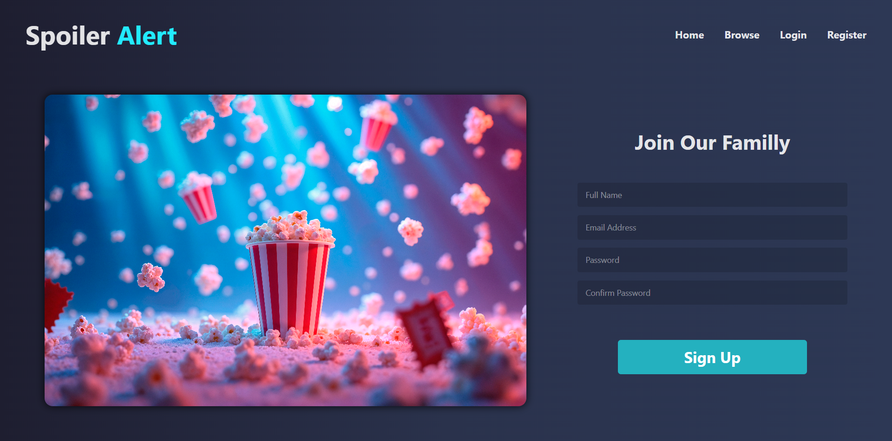
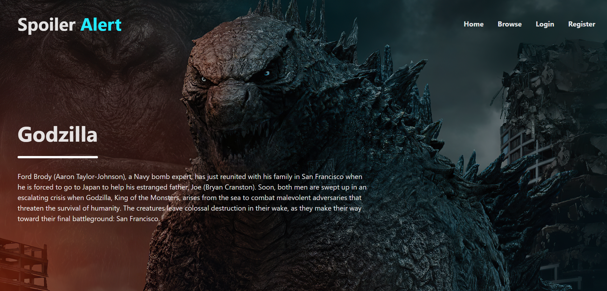
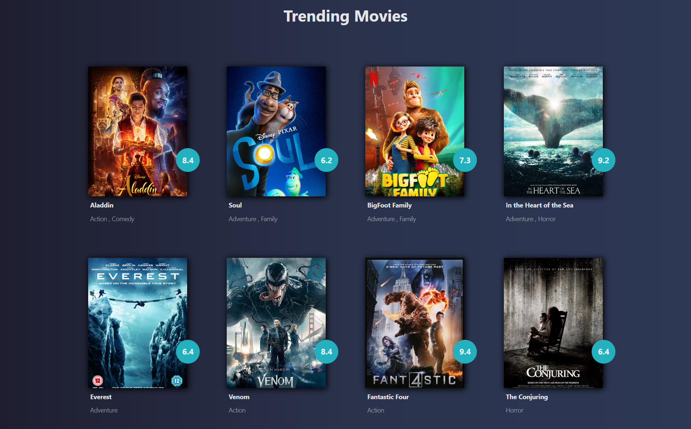
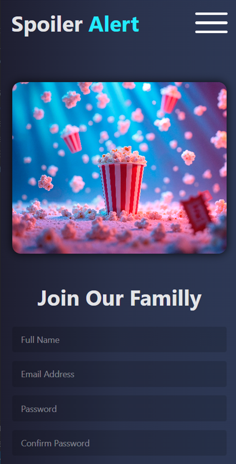
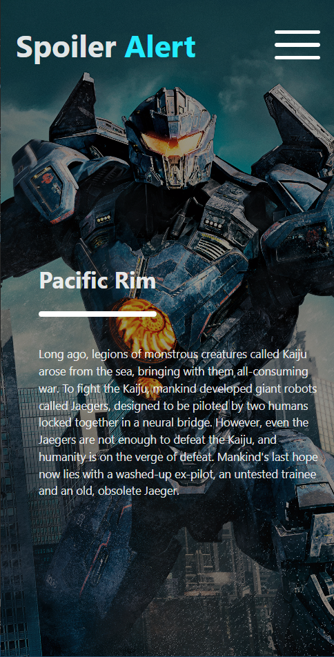
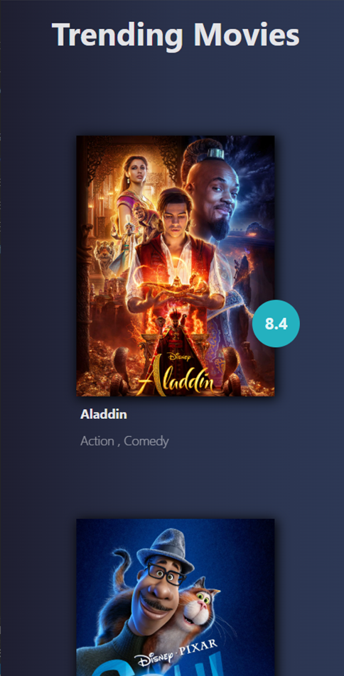

# 🎬 Spoiler Alert - Web Frontend

> A responsive and interactive movie review web application built with **React** and **Tailwind CSS**.


## 🔥 Features

- Browse movies by category
- View movie details, story, cast, ratings, and reviews
- Submit reviews (authenticated users)
- Fully responsive and styled with Tailwind CSS

## 🚀 Getting Started

### Prerequisites
- Node.js (v16+ recommended)
- npm or yarn

### Installation

```bash
git clone https://github.com/ibr0him/Spoiler-Alert-Front
cd Spoiler-Alert-Front
npm install
npm start
```

The app will run at [http://localhost:5173](http://localhost:5173).

## 🛠 Tech Stack

- React
- React Router
- Tailwind CSS
- Axios (for API calls)
- Context API / Redux

## 📁 Project Structure

```
src/
├── components/
├── pages/
├── services/
└── App.jsx
```

## 📸 Screenshots



<p>
  
  
  
</p>

## 🧑‍💻 Authors

- [Ibrahim](https://github.com/ibr0him)
